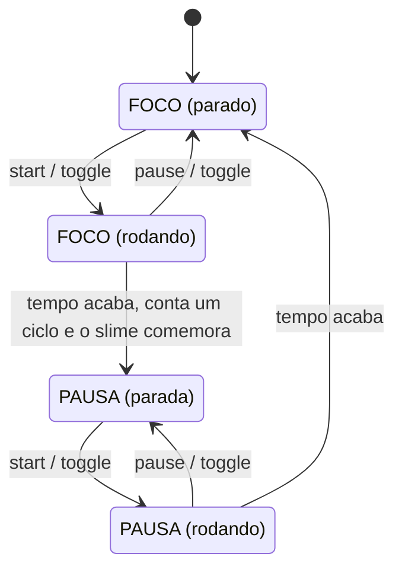

# Tamagotchi Pomodoro


Timer Pomodoro em **Python + Pygame** com um **slime em pixel art** que fica **calmo enquanto você foca**, **dorme nas pausas** e **comemora quando você completa um ciclo**. Uma **barra de energia** cai durante o foco e recarrega na pausa. Um Tamagotchi de produtividade: cumprir o foco deixa o bichinho feliz.

<p align="center">
  
</p>

> Projeto de aprendizado, feito para praticar Python, Pygame, organização de código, testes automatizados e distribuição de aplicativos. Inspirado no [pomodoro-diabrete](https://github.com/elen-c-sales/pomodoro-diabrete), com personagem, arte e código próprios.

---

## Download

Para **usar o app sem instalar Python**, baixe o instalador na página de **[Releases](https://github.com/igorfritzen/Tamagotchi_Pomodoro/releases)**:

1. Baixe o arquivo `TamagotchiPomodoro-Setup-0.1.0.exe`.
2. Dê dois cliques e siga o assistente (Avançar, Instalar, Concluir).
3. Abra pelo Menu Iniciar (ou pelo atalho da Área de Trabalho, se você marcou essa opção).

Para **desinstalar**, use *Configurações → Aplicativos*, como qualquer programa.

> **Aviso do Windows:** o instalador ainda não tem assinatura digital (um certificado pago), então o Windows pode mostrar a tela azul *"O Windows protegeu o computador"*. Isso é esperado para programas de desenvolvedores independentes. Clique em **Mais informações** e depois em **Executar assim mesmo**. O código-fonte é aberto e está todo neste repositório.

---

## Status do projeto

Versão **0.1.0 beta**. O que já funciona e o que pode vir depois:

- [x] Lógica do relógio Pomodoro (fases, pausa, reset, pular, ciclos, progresso)
- [x] Lógica do personagem (humor, animação por frames e energia)
- [x] Sprites em pixel art e janela Pygame com o slime animado
- [x] Tempo, fase, ciclos e barra de energia na tela
- [x] Controles por teclado e por botões clicáveis
- [x] Sons ao fim do foco e ao fim da pausa, com opção de mudo
- [x] Janela sempre no topo, sem borda e arrastável (Windows)
- [x] Instalador com desinstalador para Windows
- [x] Testes automatizados da lógica
- [ ] Fundo transparente na janela
- [ ] Pausa longa a cada 4 ciclos
- [ ] Salvar estatísticas entre sessões
- [ ] Configurar as durações dentro do app

---

## Demonstração

| Foco | Pausa | Ciclo concluído |
| :---: | :---: | :---: |
|  |  |  |
| **Calmo** e concentrado | **Dormindo** enquanto você descansa | **Feliz**, por alguns segundos, quando o foco termina |

---

## Índice

- [Download](#download)
- [Como funciona](#como-funciona)
  - [O personagem](#o-personagem)
  - [Ciclo de fases](#ciclo-de-fases)
  - [Energia](#energia)
  - [Animação](#animação)
  - [Sons](#sons)
  - [Janela flutuante](#janela-flutuante)
- [Controles](#controles)
- [Arquitetura](#arquitetura)
  - [Módulos](#módulos)
  - [API de `timer.py`](#api-de-timerpy)
  - [API de `character.py`](#api-de-characterpy)
  - [API de `ui.py`](#api-de-uipy)
  - [API de `overlay.py`](#api-de-overlaypy)
  - [Exemplo de uso sem interface](#exemplo-de-uso-sem-interface)
- [Executar a partir do código-fonte](#executar-a-partir-do-código-fonte)
- [Parâmetros de ajuste](#parâmetros-de-ajuste)
- [Estrutura do projeto](#estrutura-do-projeto)
- [Testes](#testes)
- [Gerar o executável e o instalador](#gerar-o-executável-e-o-instalador)
- [Decisões de projeto](#decisões-de-projeto)
- [Possíveis extensões](#possíveis-extensões)
- [Créditos](#créditos)
- [Autor](#autor)

---

## Como funciona

### O personagem

O slime é feito de **sprites em pixel art de 32×32 pixels com fundo transparente**, com **3 humores** e **2 frames** por humor. Os sprites são ampliados com *nearest-neighbor* (`pygame.transform.scale`), o que mantém os pixels nítidos.

| Humor | Quando aparece | Arquivos |
| --- | --- | --- |
| `CALM` (calmo) | durante o **foco** | `slime_calmo_1.png`, `slime_calmo_2.png` |
| `SLEEPING` (dormindo) | durante a **pausa** | `slime_dormindo_1.png`, `slime_dormindo_2.png` |
| `HAPPY` (feliz) | por alguns segundos, quando um **foco é concluído** | `slime_feliz_1.png`, `slime_feliz_2.png` |

A felicidade tem **prioridade** sobre os demais humores: enquanto durar a comemoração, o slime fica feliz independentemente da fase. Quando ela acaba, ele volta ao humor da fase atual.

### Ciclo de fases

O app alterna entre duas fases, **FOCO** (25 min) e **PAUSA** (5 min). Quando o tempo de uma fase acaba, o relógio **passa para a próxima fase e fica parado**, esperando você iniciá-la. A transição nunca começa sozinha.



Regras:

- `update(dt)` só desconta tempo quando o relógio está **rodando**.
- Quando o tempo chega a zero, `update` **devolve a fase que terminou** (ou `None` se nada terminou neste quadro). É com esse retorno que a interface decide quando chamar `character.celebrate()` e quando tocar o som.
- Apenas **focos concluídos** contam como ciclo. `skip()` troca de fase sem contar.
- `reset()` volta o tempo da fase atual ao valor inicial e pausa o relógio.

### Energia

A barra de energia mostra o "fôlego" do slime:

- No **foco**, ela começa em 100% e vai caindo até 0% no fim.
- Na **pausa**, ela **recarrega**, de 0% a 100%.
- Com o relógio parado, a barra fica parada.

A cor muda com o nível: verde acima de 50%, amarela entre 25% e 50%, vermelha abaixo disso. A conta é feita em duas peças pequenas: `timer.progress()` informa quanto da fase já passou (de 0 a 1) e `energy_level(phase, progress)` converte isso em energia.

### Animação

A cada `FRAME_SECONDS` (0,5 s por padrão), o personagem alterna entre os dois frames do humor atual, criando um efeito de "respiração". O índice do frame é calculado com o operador `%`, então a animação se repete sem passar do limite.

### Sons

Dois sons curtos, sintetizados por código (sem direitos de terceiros), marcam o fim de cada fase:

| Arquivo | Quando toca |
| --- | --- |
| `assets/sounds/fim_foco.wav` | quando um foco termina (junto da comemoração do slime) |
| `assets/sounds/fim_pausa.wav` | quando uma pausa termina |

A tecla `M` liga e desliga o som, e a tela mostra o estado atual. Se o computador não tiver dispositivo de áudio, o app continua funcionando, apenas sem som.

### Janela flutuante

No Windows, o app funciona como um pequeno widget:

- **Sempre no topo** (`T`): a janela fica por cima dos outros aplicativos.
- **Sem borda** (`WINDOW_BORDERLESS`): sem a barra de título do sistema, com um contorno e um botão `X` no canto.
- **Arrastável:** clique e arraste em qualquer área vazia da janela.

Essas funções chamam a API do Windows via `ctypes` e ficam isoladas em `overlay.py`. Em outros sistemas, elas simplesmente não fazem nada.

---

## Controles

| Ação | Teclado | Mouse |
| --- | --- | --- |
| Iniciar ou pausar o relógio | `Espaço` | botão **Iniciar/Pausar** |
| Resetar a fase atual | `R` | botão **Resetar** |
| Pular para a próxima fase (não conta como ciclo) | `S` | botão **Pular** |
| Ligar ou desligar o som | `M` | — |
| Fixar a janela por cima dos outros apps (Windows) | `T` | — |
| Mover a janela | — | arrastar em área vazia |
| Fechar | `Esc` ou `X` | botão **X** (canto superior direito) |

Quando um foco termina, o relógio troca para a pausa e fica parado até você iniciar.

---

## Arquitetura

O projeto separa **lógica** de **apresentação**. `timer.py` e `character.py` **não importam o Pygame**, então toda a mecânica pode ser testada sem abrir janela. O código específico do Windows fica isolado em `overlay.py`.

### Módulos

| Arquivo | Responsabilidade |
| --- | --- |
| `config.py` | Constantes: durações, janela, FPS, escala dos sprites, cores, fontes, botões, energia, som e caminhos. |
| `timer.py` | Lógica pura do relógio: fases, contagem, ciclos, progresso e formatação do tempo. |
| `character.py` | Lógica pura do personagem: humor, comemoração, frame da animação e nível de energia. |
| `assets.py` | Carrega os sprites e os sons do disco. |
| `ui.py` | Desenha a tela (fase, slime, energia, tempo, ciclos, botões). Só **lê** o estado, não altera a lógica. |
| `overlay.py` | Funções do Windows: sempre no topo e arrasto da janela sem borda. |
| `main.py` | Janela Pygame, loop principal, teclado/mouse e ligação entre timer, personagem, sons e interface. |

Fora do pacote, `run.py` é o ponto de entrada usado para gerar o executável.

A dependência vai em um só sentido: `character` conhece o `timer` (usa `Phase`), mas o `timer` não conhece o `character`. A interface informa o que o usuário pediu (`get_action`), e quem age sobre o timer é o `main.py`.

### API de `timer.py`

**`Phase`** (`Enum`): `FOCUS` e `BREAK`.

**`PomodoroTimer`**

| Método | Efeito | Retorna |
| --- | --- | --- |
| `start()` | coloca o relógio para rodar | `None` |
| `pause()` | pausa a contagem | `None` |
| `toggle()` | inverte entre rodando e pausado | `None` |
| `reset()` | volta o tempo da fase atual ao início e pausa | `None` |
| `skip()` | pula para a próxima fase, sem contar ciclo | `None` |
| `update(dt)` | desconta `dt` segundos se estiver rodando | fase que terminou, ou `None` |
| `progress()` | fração da fase já cumprida, de `0.0` a `1.0` | `float` |
| `formatted_time()` | tempo restante como `MM:SS` | `str` |

| Atributo | Descrição |
| --- | --- |
| `phase` | fase atual (`Phase.FOCUS` ou `Phase.BREAK`) |
| `remaining` | segundos restantes na fase |
| `running` | `True` se o relógio está contando |
| `completed_cycles` | quantidade de focos concluídos |

### API de `character.py`

**`Mood`** (`Enum`): `CALM`, `SLEEPING` e `HAPPY`.

**`energy_level(phase, progress)`**: devolve a energia (de `0.0` a `1.0`). No foco vale `1 - progress`; na pausa vale `progress`.

**`Character`**

| Método | Efeito |
| --- | --- |
| `celebrate()` | inicia a comemoração (`HAPPY_SECONDS` segundos de felicidade) |
| `update(dt, phase)` | avança a animação e recalcula o humor com base na fase atual |

| Atributo | Descrição |
| --- | --- |
| `mood` | humor atual (`Mood`) |
| `frame` | índice do frame da animação (`0` ou `1`) |

### API de `ui.py`

**`Button`**: retângulo clicável com texto e destaque ao passar o mouse.

| Método | Efeito |
| --- | --- |
| `is_hovered()` | `True` se o mouse está sobre o botão |
| `was_clicked(event)` | `True` se o evento é um clique esquerdo dentro do botão |
| `draw(screen, font)` | desenha o botão |

**`Interface`**

| Método | Efeito |
| --- | --- |
| `draw(screen, timer, sprite, muted)` | desenha um quadro completo |
| `draw_energy_bar(screen, energy)` | desenha a barra de energia e a porcentagem |
| `draw_text(screen, text, font, center)` | desenha um texto centralizado em um ponto |
| `get_action(event)` | devolve o nome da ação do botão clicado (`"toggle"`, `"reset"`, `"skip"`, `"quit"`) ou `None` |

A `Interface` apenas lê o `timer`. Quem escolhe o sprite certo (pelo humor e frame do personagem) é o `main.py`.

### API de `overlay.py`

| Função | Efeito | Retorna |
| --- | --- | --- |
| `is_supported()` | indica se o sistema é Windows | `bool` |
| `set_always_on_top(enabled)` | liga ou desliga o modo "sempre no topo" | `True` se o sistema aceitou |
| `start_drag()` | inicia o arrasto da janela sem borda | `None` |

Fora do Windows, `set_always_on_top` devolve `False` e `start_drag` não faz nada.

### Exemplo de uso sem interface

```python
from Tamagotchi_Pomodoro.character import energy_level
from Tamagotchi_Pomodoro.timer import Phase, PomodoroTimer

timer = PomodoroTimer()
timer.start()
timer.update(10)
print(timer.formatted_time())  # 24:50
print(energy_level(timer.phase, timer.progress()))  # energia no foco

finished = timer.update(1490)  # o foco termina
print(finished)                # Phase.FOCUS
print(timer.phase)             # Phase.BREAK
print(timer.completed_cycles)  # 1
```

---

## Executar a partir do código-fonte

Requisitos: **Python 3.12** e **Pygame**. Testado no **Windows**.

```powershell
git clone https://github.com/igorfritzen/Tamagotchi_Pomodoro.git
cd Tamagotchi_Pomodoro

python -m venv .venv
.venv\Scripts\Activate.ps1

pip install -r requirements.txt

cd src
python -m Tamagotchi_Pomodoro.main
```

> Se o PowerShell bloquear a ativação do venv, rode uma vez `Set-ExecutionPolicy -Scope CurrentUser RemoteSigned`.
>
> Use sempre o venv ativo ao instalar pacotes. Versões muito novas do Python podem não ter pacote pronto do Pygame e tentar compilá-lo, o que falha.

---

## Parâmetros de ajuste

Todos em `src/Tamagotchi_Pomodoro/config.py`:

| Parâmetro | Padrão | Efeito |
| --- | --- | --- |
| `FOCUS_MINUTES` | `25` | duração do foco (min) |
| `BREAK_MINUTES` | `5` | duração da pausa (min) |
| `WINDOW_WIDTH` / `WINDOW_HEIGHT` | `480` / `360` | tamanho da janela (px) |
| `WINDOW_BORDERLESS` | `True` | janela sem borda, arrastável e com botão `X` |
| `FPS` | `60` | quadros por segundo |
| `SPRITE_SCALE` | `6` | fator de ampliação da pixel art |
| `HAPPY_SECONDS` | `3` | duração da comemoração (s) |
| `FRAME_SECONDS` | `0.5` | tempo de cada frame da animação (s) |
| `FRAMES_PER_MOOD` | `2` | frames por humor |
| `SOUND_VOLUME` | `0.6` | volume dos sons (de `0.0` a `1.0`) |
| `TIME_FONT_SIZE` / `INFO_FONT_SIZE` | `72` / `28` | tamanho das fontes do tempo e dos textos |
| `BUTTON_WIDTH` / `BUTTON_HEIGHT` / `BUTTON_GAP` / `BUTTON_Y` | `130` / `32` / `15` / `320` | tamanho e posição dos botões (px) |
| `BUTTON_COLOR` / `BUTTON_HOVER_COLOR` / `BUTTON_TEXT_COLOR` | `(209, 203, 149)` / `(184, 176, 120)` / `(10, 26, 47)` | cores dos botões e do texto dentro deles (RGB) |
| `ENERGY_BAR_WIDTH` / `ENERGY_BAR_HEIGHT` / `ENERGY_BAR_Y` | `200` / `12` / `52` | tamanho e posição da barra de energia (px) |
| `ENERGY_MEDIUM` / `ENERGY_LOW` | `0.5` / `0.25` | limites de cor da barra |
| `BACKGROUND_COLOR` / `TEXT_COLOR` | — | cor de fundo da janela e do texto (RGB) |

Dica: durante o desenvolvimento, use `FOCUS_MINUTES = 0.1` para ver o fluxo completo (inclusive o som e a comemoração) sem esperar 25 minutos.

---

## Estrutura do projeto

```
Tamagotchi_Pomodoro/
├── assets/
│   ├── sprites/               # PNGs 32x32 do slime (slime_<humor>_<frame>.png)
│   ├── sounds/                # fim_foco.wav e fim_pausa.wav
│   ├── icon.png               # ícone da janela
│   └── icon.ico               # ícone do executável e do instalador
├── docs/                      # imagens usadas neste README
├── src/
│   └── Tamagotchi_Pomodoro/
│       ├── __init__.py
│       ├── main.py            # janela + loop principal
│       ├── config.py          # constantes
│       ├── timer.py           # lógica do relógio (sem Pygame)
│       ├── character.py       # lógica do personagem (sem Pygame)
│       ├── assets.py          # carregamento de sprites e sons
│       ├── ui.py              # desenho da tela e botões
│       └── overlay.py         # recursos do Windows (topo e arrasto)
├── tests/                     # testes automatizados da lógica
├── run.py                     # ponto de entrada do executável
├── build.bat                  # gera o executável com PyInstaller
├── installer.iss              # script do instalador (Inno Setup)
├── pytest.ini
├── requirements.txt
├── .gitignore
└── README.md
```

---

## Testes

```powershell
pip install pytest
pytest
```

Rode na **raiz** do projeto, com o venv ativo. O `pytest.ini` aponta o `pythonpath` para `src`.

- **Timer:** estado inicial, contagem (parado e rodando), fim do foco, `skip`, `reset`, `toggle`, formatação do tempo e `progress`.
- **Personagem:** humor em cada fase, comemoração e seu fim, alternância dos frames e nível de energia.
- **Overlay:** detecção do sistema e comportamento fora do Windows (com `monkeypatch`, sem precisar de outro computador).

A lógica (`timer.py` e `character.py`) é testada sem abrir janela e sem depender do Pygame, e os testes usam valores do `config`, então continuam válidos se as durações mudarem.

---

## Gerar o executável e o instalador

Para quem quiser empacotar o app (Windows):

```powershell
pip install pyinstaller
.\build.bat
```

Isso gera a pasta `dist\TamagotchiPomodoro\` com o executável, usando o **PyInstaller** em modo `--onedir` e incluindo a pasta `assets`. Em seguida, para criar o instalador:

1. Instale o [Inno Setup](https://jrsoftware.org/isinfo.php) (gratuito).
2. Abra o `installer.iss` e use **Build → Compile**.
3. O instalador (`TamagotchiPomodoro-Setup-0.1.0.exe`) é gerado em `installer_output\`.

O instalador não exige permissão de administrador, cria atalhos e registra um desinstalador em *Configurações → Aplicativos*. As pastas `dist/`, `build/` e `installer_output/` não são versionadas: o instalador é distribuído pela página de **Releases**.

---

## Decisões de projeto

- **Lógica separada da interface:** `timer.py` e `character.py` não conhecem o Pygame, o que permite testes rápidos e facilita trocar a camada gráfica.
- **Tempo por `dt`:** a lógica recebe quantos segundos passaram, em vez de medir o tempo sozinha. Isso torna o comportamento previsível e testável (basta simular `update(10)`).
- **`update` devolve a fase que terminou:** a interface e o `main` reagem ao evento (comemorar, tocar som), sem que o timer precise conhecer o personagem ou o áudio.
- **Interface só lê o estado:** `ui.py` desenha a partir do `timer` e informa cliques como ações; quem altera a lógica é o `main.py`. O mesmo conjunto de ações atende teclado e mouse.
- **`Enum` para fases e humores:** evita erros de digitação com textos soltos.
- **Constantes centralizadas em `config.py`:** mudar uma duração ou cor é editar um único lugar.
- **Sprites em PNG com fundo transparente:** pixel art real, carregada uma vez e ampliada sem borrar.
- **Código do Windows isolado:** o uso de `ctypes` fica só em `overlay.py` e degrada com elegância fora do Windows. O áudio também: sem dispositivo de som, o app segue funcionando.
- **`src` layout:** o código fica em `src/`, separado de testes, assets e documentação.
- **Executável compatível com os assets:** `config.py` detecta quando está empacotado (`sys.frozen`) e busca os arquivos na pasta do executável.

---

## Possíveis extensões

- Fundo transparente na janela, deixando só o slime e a interface flutuando.
- Pausa longa a cada 4 ciclos.
- Salvar ciclos e estatísticas entre sessões.
- Configurar as durações dentro do app.
- Suporte à janela flutuante em Linux e macOS.
- Mais humores e animações para o slime (por exemplo, um frame de cansaço quando a energia está baixa).
- Assinar o instalador digitalmente, para evitar o aviso do SmartScreen.

---

## Créditos

- Inspirado no [pomodoro-diabrete](https://github.com/elen-c-sales/pomodoro-diabrete), de Elen C. Sales: a ideia de um bichinho que reage ao ciclo Pomodoro e a organização deste README vieram de lá. O código, o personagem (slime), os sprites e as mecânicas são próprios deste projeto.
- Pixel art do slime (32×32) desenhada por mim, inspirada em slimes clássicos de pixel art.
- Efeitos sonoros sintetizados por código para este projeto.

## Autor

**Igor Fritzen**

- GitHub: [github.com/igorfritzen](https://github.com/igorfritzen)
- LinkedIn: [linkedin.com/in/igor-rafael-chagas-fritzen-516207205](https://www.linkedin.com/in/igor-rafael-chagas-fritzen-516207205)
