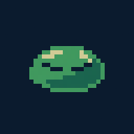
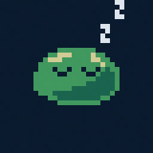
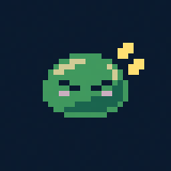
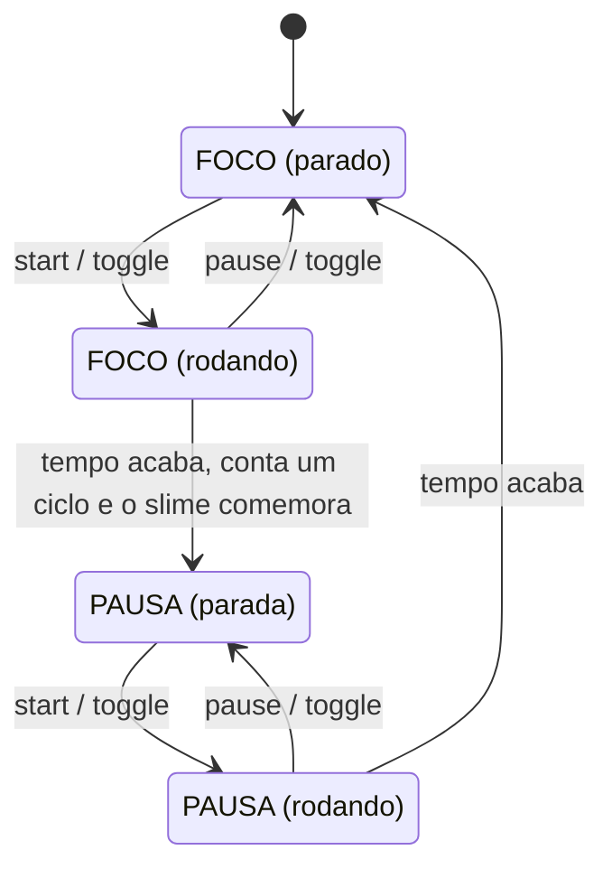

# Tamagotchi Pomodoro


Timer Pomodoro em **Python + Pygame** com um **slime em pixel art** que fica **calmo enquanto você foca**, **dorme nas pausas** e **comemora quando você completa um ciclo**. Um Tamagotchi de produtividade: cumprir o foco deixa o bichinho feliz.

<p align="center">
  
</p>

> Projeto de aprendizado, feito para praticar Python, Pygame, organização de código e testes automatizados. Inspirado no [pomodoro-diabrete](https://github.com/elen-c-sales/pomodoro-diabrete), com personagem, arte e código próprios.

---

## Status do projeto

O projeto está **em desenvolvimento**. O que já funciona e o que vem a seguir:

- [x] Lógica do relógio Pomodoro (fases, pausa, reset, pular, ciclos)
- [x] Lógica do personagem (humor e animação por frames)
- [x] Carregamento e ampliação dos sprites em pixel art
- [x] Janela Pygame com o slime animado
- [x] Testes automatizados da lógica (15 testes)
- [ ] Ligar o timer à interface (mostrar o tempo e reagir ao fim de cada fase)
- [ ] Botões e atalhos (iniciar, pausar, pular, resetar)
- [ ] Contador de ciclos na tela

---

## Demonstração

| Foco | Pausa | Ciclo concluído |
| :---: | :---: | :---: |
|  |  |  |
| **Calmo** e concentrado | **Dormindo** enquanto você descansa | **Feliz**, por alguns segundos, quando o foco termina |

---

## Índice

- [Como funciona](#como-funciona)
  - [O personagem](#o-personagem)
  - [Ciclo de fases](#ciclo-de-fases)
  - [Animação](#animação)
- [Arquitetura](#arquitetura)
  - [Módulos](#módulos)
  - [API de `timer.py`](#api-de-timerpy)
  - [API de `character.py`](#api-de-characterpy)
  - [Exemplo de uso sem interface](#exemplo-de-uso-sem-interface)
- [Instalação e execução](#instalação-e-execução)
- [Controles](#controles)
- [Parâmetros de ajuste](#parâmetros-de-ajuste)
- [Estrutura do projeto](#estrutura-do-projeto)
- [Testes](#testes)
- [Decisões de projeto](#decisões-de-projeto)
- [Possíveis extensões](#possíveis-extensões)
- [Créditos](#créditos)
- [Autor](#autor)

---

## Como funciona

### O personagem

O slime é feito de **sprites em pixel art de 32×32 pixels**, com **3 humores** e **2 frames** por humor. Os sprites são ampliados com *nearest-neighbor* (`pygame.transform.scale`), o que mantém os pixels nítidos.

| Humor | Quando aparece | Arquivos |
| --- | --- | --- |
| `CALM` (calmo) | durante o **foco** | `slime_calmo_1.png`, `slime_calmo_2.png` |
| `SLEEPING` (dormindo) | durante a **pausa** | `slime_dormindo_1.png`, `slime_dormindo_2.png` |
| `HAPPY` (feliz) | por alguns segundos, quando um **foco é concluído** | `slime_feliz_1.png`, `slime_feliz_2.png` |

A felicidade tem **prioridade** sobre os demais humores: enquanto durar a comemoração, o slime fica feliz independentemente da fase. Quando ela acaba, ele volta ao humor da fase atual.

### Ciclo de fases

O app alterna entre duas fases, **FOCO** (25 min) e **PAUSA** (5 min). Quando o tempo de uma fase acaba, o relógio **passa para a próxima fase e fica parado**, esperando você iniciá-la. A transição nunca começa sozinha.



Regras:

- `update(dt)` só desconta tempo quando o relógio está **rodando**.
- Quando o tempo chega a zero, `update` **devolve a fase que terminou** (ou `None` se nada terminou neste quadro). É com esse retorno que a interface decide quando chamar `character.celebrate()`.
- Apenas **focos concluídos** contam como ciclo. `skip()` troca de fase sem contar.
- `reset()` volta o tempo da fase atual ao valor inicial e pausa o relógio.

### Animação

A cada `FRAME_SECONDS` (0,5 s por padrão), o personagem alterna entre os dois frames do humor atual, criando um efeito de "respiração". O índice do frame é calculado com o operador `%`, então a animação se repete sem passar do limite.

---

## Arquitetura

O projeto separa **lógica** de **apresentação**. `timer.py` e `character.py` **não importam o Pygame**, então toda a mecânica pode ser testada sem abrir janela.

### Módulos

| Arquivo | Responsabilidade |
| --- | --- |
| `config.py` | Constantes: durações, janela, FPS, escala dos sprites, cores e caminhos. |
| `timer.py` | Lógica pura do relógio: fases, contagem, ciclos e formatação do tempo. |
| `character.py` | Lógica pura do personagem: humor, comemoração e frame da animação. |
| `assets.py` | Carrega os sprites do disco e os amplia. |
| `main.py` | Janela Pygame, loop principal, eventos e desenho na tela. |

A dependência vai em um só sentido: `character` conhece o `timer` (usa `Phase`), mas o `timer` não conhece o `character`.

### API de `timer.py`

**`Phase`** (`Enum`): `FOCUS` e `BREAK`.

**`PomodoroTimer`**

| Método | Efeito | Retorna |
| --- | --- | --- |
| `start()` | coloca o relógio para rodar | `None` |
| `pause()` | pausa a contagem | `None` |
| `toggle()` | inverte entre rodando e pausado | `None` |
| `reset()` | volta o tempo da fase atual ao início e pausa | `None` |
| `skip()` | pula para a próxima fase, sem contar ciclo | `None` |
| `update(dt)` | desconta `dt` segundos se estiver rodando | fase que terminou, ou `None` |
| `formatted_time()` | tempo restante como `MM:SS` | `str` |

| Atributo | Descrição |
| --- | --- |
| `phase` | fase atual (`Phase.FOCUS` ou `Phase.BREAK`) |
| `remaining` | segundos restantes na fase |
| `running` | `True` se o relógio está contando |
| `completed_cycles` | quantidade de focos concluídos |

### API de `character.py`

**`Mood`** (`Enum`): `CALM`, `SLEEPING` e `HAPPY`.

**`Character`**

| Método | Efeito |
| --- | --- |
| `celebrate()` | inicia a comemoração (`HAPPY_SECONDS` segundos de felicidade) |
| `update(dt, phase)` | avança a animação e recalcula o humor com base na fase atual |

| Atributo | Descrição |
| --- | --- |
| `mood` | humor atual (`Mood`) |
| `frame` | índice do frame da animação (`0` ou `1`) |

### Exemplo de uso sem interface

```python
from Tamagotchi_Pomodoro.timer import Phase, PomodoroTimer

timer = PomodoroTimer()
timer.start()
timer.update(10)
print(timer.formatted_time())  # 24:50

finished = timer.update(1490)  # o foco termina
print(finished)                # Phase.FOCUS
print(timer.phase)             # Phase.BREAK
print(timer.completed_cycles)  # 1
```

---

## Instalação e execução

Requisitos: **Python 3.12** e **Pygame**. Testado no **Windows**.

```powershell
git clone https://github.com/igorfritzen/Tamagotchi_Pomodoro.git
cd Tamagotchi_Pomodoro

python -m venv .venv
.venv\Scripts\Activate.ps1

pip install -r requirements.txt

cd src
python -m Tamagotchi_Pomodoro.main
```

> Se o PowerShell bloquear a ativação do venv, rode uma vez `Set-ExecutionPolicy -Scope CurrentUser RemoteSigned`.
>
> Use sempre o venv ativo ao instalar pacotes. Versões muito novas do Python podem não ter pacote pronto do Pygame e tentar compilá-lo, o que falha.

---

## Controles

Atalhos da versão atual, usados apenas para demonstrar os humores. Serão substituídos pelos controles do timer.

| Ação | Entrada |
| --- | --- |
| Alternar entre foco (calmo) e pausa (dormindo) | `B` |
| Fazer o slime comemorar | `Espaço` |
| Fechar | botão X da janela |

---

## Parâmetros de ajuste

Todos em `src/Tamagotchi_Pomodoro/config.py`:

| Parâmetro | Padrão | Efeito |
| --- | --- | --- |
| `FOCUS_MINUTES` | `25` | duração do foco (min) |
| `BREAK_MINUTES` | `5` | duração da pausa (min) |
| `WINDOW_WIDTH` / `WINDOW_HEIGHT` | `480` / `360` | tamanho da janela (px) |
| `FPS` | `60` | quadros por segundo |
| `SPRITE_SCALE` | `8` | fator de ampliação da pixel art |
| `HAPPY_SECONDS` | `3` | duração da comemoração (s) |
| `FRAME_SECONDS` | `0.5` | tempo de cada frame da animação (s) |
| `FRAMES_PER_MOOD` | `2` | frames por humor |
| `BACKGROUND_COLOR` | `10, 26, 47` | cor de fundo da janela (RGB) |
| `TEXT_COLOR` | `230, 230, 240` | cor do texto (RGB) |

Dica: durante o desenvolvimento, use `FOCUS_MINUTES = 1` para ver o fluxo completo sem esperar 25 minutos.

---

## Estrutura do projeto

```
Tamagotchi_Pomodoro/
├── assets/
│   ├── sprites/               # PNGs 32x32 do slime (slime_<humor>_<frame>.png)
│   └── sounds/                # efeitos sonoros (reservado)
├── docs/                      # imagens usadas neste README
├── src/
│   └── Tamagotchi_Pomodoro/
│       ├── __init__.py
│       ├── main.py            # janela + loop principal
│       ├── config.py          # constantes
│       ├── timer.py           # lógica do relógio (sem Pygame)
│       ├── character.py       # lógica do personagem (sem Pygame)
│       └── assets.py          # carregamento dos sprites
├── tests/
│   ├── test_timer.py
│   └── test_character.py
├── pytest.ini
├── requirements.txt
├── .gitignore
└── README.md
```

---

## Testes

```powershell
pip install pytest
pytest
```

Rode na **raiz** do projeto, com o venv ativo. O `pytest.ini` aponta o `pythonpath` para `src`.

- `test_timer.py` cobre o estado inicial, a contagem (parado e rodando), o fim do foco, `skip`, `reset`, `toggle` e a formatação do tempo.
- `test_character.py` cobre o humor em cada fase, a comemoração e seu fim, e a alternância dos frames.

Os testes não abrem janela nem dependem do Pygame, e usam valores do `config`, então continuam válidos se as durações mudarem.

---

## Decisões de projeto

- **Lógica separada da interface:** `timer.py` e `character.py` não conhecem o Pygame, o que permite testes rápidos e facilita trocar a camada gráfica.
- **Tempo por `dt`:** a lógica recebe quantos segundos passaram, em vez de medir o tempo sozinha. Isso torna o comportamento previsível e testável (basta simular `update(10)`).
- **`update` devolve a fase que terminou:** a interface reage ao evento (por exemplo, chamando `celebrate()`), sem que o timer precise conhecer o personagem.
- **`Enum` para fases e humores:** evita erros de digitação com textos soltos.
- **Constantes centralizadas em `config.py`:** mudar uma duração ou cor é editar um único lugar.
- **Sprites em arquivos PNG:** pixel art real, carregada uma vez e ampliada sem borrar.
- **`src` layout:** o código fica em `src/`, separado de testes, assets e documentação.

---

## Possíveis extensões

- Ligar timer e personagem na interface, com botões e atalhos.
- Barra de energia que cai durante o foco, fazendo o slime ficar cansado até dormir.
- Pausa longa a cada 4 ciclos.
- Sons no fim de cada fase e na comemoração.
- Fundo transparente nos sprites e janela sempre no topo (overlay no Windows).
- Salvar ciclos e estatísticas entre sessões.
- Configurar as durações dentro do app.
- Empacotar como executável (PyInstaller).

---

## Créditos

- Inspirado no [pomodoro-diabrete](https://github.com/elen-c-sales/pomodoro-diabrete), de Elen C. Sales: a ideia de um bichinho que reage ao ciclo Pomodoro e a organização deste README vieram de lá. O código, o personagem (slime), os sprites e as mecânicas são próprios deste projeto.
- Pixel art do slime (32×32) desenhada por mim, inspirada em slimes clássicos de pixel art.

## Autor

**Igor Fritzen**

- GitHub: [github.com/igorfritzen](https://github.com/igorfritzen)
- LinkedIn: [linkedin.com/in/igor-rafael-chagas-fritzen-516207205](https://www.linkedin.com/in/igor-rafael-chagas-fritzen-516207205)
